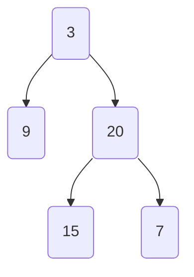

# Grind 75
## Week 2
### Balanced Binary Tree
data: `[3,9,20,null,null,15,7]`
Visualized as: 

```typescript
/**
 * Definition for a binary tree node.
 * class TreeNode {
 *     val: number
 *     left: TreeNode | null
 *     right: TreeNode | null
 *     constructor(val?: number, left?: TreeNode | null, right?: TreeNode | null) {
 *         this.val = (val===undefined ? 0 : val)
 *         this.left = (left===undefined ? null : left)
 *         this.right = (right===undefined ? null : right)
 *     }
 * }
 */

function isBalanced(root: TreeNode | null): boolean {
    // if the root is null we've reached a leaf so return null.
    if (root == null) return true;

    const left = height(root.left);
    const right = height(root.right);
    // both the left and right subtrees should not differ in height,
    // and the subtrees of left and right should also themselves be balanced.
    return Math.abs(left - right) <= 1 && isBalanced(root.left) && isBalanced(root.right); 
};

function height(root: TreeNode | null): number {
    // if we've reached a leaf, return -1
    if (root == null) return -1;
    let hl = height(root.left);
    let hr = height(root.right);

    let res = 1+ Math.max(hl, hr);
    return res;
}
```
```
left subtree of 9 -1
right subtree of 9 -1
returning 1 + max(-1,-1) = 0
left subtree of root height: 0
-----
left subtree of 15 -1
right subtree of 15 -1
returning 1 + max(-1,-1) = 0
left subtree of 20 0
left subtree of 7 -1
right subtree of 7 -1
returning 1 + max(-1,-1) = 0
right subtree of 20 0
returning 1 + max(0,0) = 1
right subtree of root height: 1
-----
left subtree of root height: -1
-----
right subtree of root height: -1
-----
left subtree of 15 -1
right subtree of 15 -1
returning 1 + max(-1,-1) = 0
left subtree of root height: 0
-----
left subtree of 7 -1
right subtree of 7 -1
returning 1 + max(-1,-1) = 0
right subtree of root height: 0
-----
left subtree of root height: -1
-----
right subtree of root height: -1
-----
left subtree of root height: -1
-----
right subtree of root height: -1
-----
```
