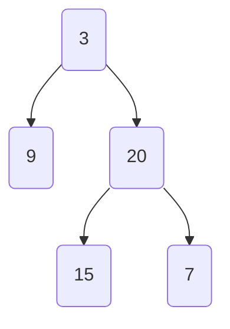

# Grind 75
## Week 2
### Balanced Binary Tree
data: `[3,9,20,null,null,15,7]`
Visualized as: 

```typescript
/**
 * Definition for a binary tree node.
 * class TreeNode {
 *     val: number
 *     left: TreeNode | null
 *     right: TreeNode | null
 *     constructor(val?: number, left?: TreeNode | null, right?: TreeNode | null) {
 *         this.val = (val===undefined ? 0 : val)
 *         this.left = (left===undefined ? null : left)
 *         this.right = (right===undefined ? null : right)
 *     }
 * }
 */

function isBalanced(root: TreeNode | null): boolean {
    // if the root is null we've reached a leaf so return null.
    if (root == null) return true;

    const left = height(root.left);
    const right = height(root.right);
    // both the left and right subtrees should not differ in height by more than 1,
    // and the subtrees of left and right should also themselves be balanced.
    return Math.abs(left - right) <= 1 && isBalanced(root.left) && isBalanced(root.right); 
};

function height(root: TreeNode | null): number {
    // if we've reached a leaf, return -1
    if (root == null) return -1;
    let hl = height(root.left);
    let hr = height(root.right);

    let res = 1+ Math.max(hl, hr);
    return res;
}
```
```
left subtree of 9 -1
right subtree of 9 -1
returning 1 + max(-1,-1) = 0
left subtree of root height: 0
-----
left subtree of 15 -1
right subtree of 15 -1
returning 1 + max(-1,-1) = 0
left subtree of 20 0
left subtree of 7 -1
right subtree of 7 -1
returning 1 + max(-1,-1) = 0
right subtree of 20 0
returning 1 + max(0,0) = 1
right subtree of root height: 1
-----
left subtree of root height: -1
-----
right subtree of root height: -1
-----
left subtree of 15 -1
right subtree of 15 -1
returning 1 + max(-1,-1) = 0
left subtree of root height: 0
-----
left subtree of 7 -1
right subtree of 7 -1
returning 1 + max(-1,-1) = 0
right subtree of root height: 0
-----
left subtree of root height: -1
-----
right subtree of root height: -1
-----
left subtree of root height: -1
-----
right subtree of root height: -1
-----
```
### First Bad Version
Time complexity: O(log n) since this is a binary search.
Space complexity: O(1) since only the index variables needed.

Assume an array of 7 versions from 1 to 7. They're `[G, G, B, B, B, B, B]`

start = 1, end = 7, middle = 1 + floor(7-1/2) = 4. isBad(4) = true, so end = 4.

start = 1, end = 4, middle = 1 + floor(4-1/2) = 2, isBad(2) = false, so start = 3.

start = 3, end = 4, middle = 3 + floor(4-3/2) =3, isBad(3) = true, so end = 3.

start = end, so terminate loop.

```typescript
/**
 * The knows API is defined in the parent class Relation.
 * isBadVersion(version: number): boolean {
 *     ...
 * };
 */
/**
* problem is effectively a binary search. 
*/
var solution = function(isBadVersion: any) {

    return function(n: number): number {
        let start = 1;
        let end = n;
        while (start < end) {
            let middle = Math.floor(start + ((end - start)/2))
            // if bad version is the middle, first bad version is before middle.
            // we can readjust our end to the middle.
            if (isBadVersion(middle)) {
                end = middle;
            } else {
                // if middle isn't bad, first bad versions start after.
                // so we readjust starting position.
                start = middle + 1;
            }
        }
        return start;
    };
};
```
### Implement Queue using Stacks
This is a silly problem ngl.
```typescript
class MyQueue {
    private s1: number[];
    private s2: number[];
    private front: number;
    constructor() {
        this.s1 = [];
        this.s2 = [];
    }

    push(x: number): void {
        // if empty, set the front of queue.
        if (this.s1.length === 0) this.front = x;
        this.s1.push(x);
    }

    pop(): number {
        // first we insert stack 1 to stack 2 in reverse order
        // then return the top of stack
        if(this.s2.length === 0) {
            while (this.s1.length > 0) {
                this.s2.push(this.s1.pop());
            }
        }
        return this.s2.pop();
    }

    peek(): number {
        // if stack 1 has been previously emptied, return top of stack 2
        // else if pop has never been called before, front can be returned
        if (!(this.s2.length === 0)) {
            return this.s2[this.s2.length - 1];
        }
        return this.front;
    }

    empty(): boolean {
        return this.s1.length == 0 && this.s2.length === 0;
    }
}

/**
 * Your MyQueue object will be instantiated and called as such:
 * var obj = new MyQueue()
 * obj.push(x)
 * var param_2 = obj.pop()
 * var param_3 = obj.peek()
 * var param_4 = obj.empty()
 */
```

### Linked List Cycle
```typescript
/**
 * Definition for singly-linked list.
 * class ListNode {
 *     val: number
 *     next: ListNode | null
 *     constructor(val?: number, next?: ListNode | null) {
 *         this.val = (val===undefined ? 0 : val)
 *         this.next = (next===undefined ? null : next)
 *     }
 * }
 */

function hasCycle(head: ListNode | null): boolean {
    // consider a race, around a circular track.
    // if one runner is faster, they'll eventually lap the other
    // at some point. similarly, at some point the fast pointer
    // will lap the slow pointer.
   if (head == null) return false;
   let slow = head;
   let fast = head.next;

   while(slow !== fast) {
    // if the faster pointer has hit the second last node in a non-cycle
    // it will point to null. 
    // if the faster pointer has instead the last node, the next node will also be null.
    if(fast === null || fast.next === null) {
        return false;
    }
    slow = slow.next;
    fast = fast.next.next;
   }
    return true;
};
```
### Lowest Common Ancestor of a Binary Search Tree
BST Properties:
- Left subtree of a node N contains nodes whose values are lesser than or equal to node N's value.
- Right subtree of a node N contains nodes whose values are greater than node N's value.
- Both left and right subtrees are also BSTs.
```typescript
/**
 * Definition for a binary tree node.
 * class TreeNode {
 *     val: number
 *     left: TreeNode | null
 *     right: TreeNode | null
 *     constructor(val?: number, left?: TreeNode | null, right?: TreeNode | null) {
 *         this.val = (val===undefined ? 0 : val)
 *         this.left = (left===undefined ? null : left)
 *         this.right = (right===undefined ? null : right)
 *     }
 * }
 */

function lowestCommonAncestor(root: TreeNode | null, p: TreeNode | null, q: TreeNode | null): TreeNode | null {
	const pVal = p.val;
    const qVal = q.val;
    let node = root;
    while (node != null) {
        let parentVal = node.val;
        if (pVal > parentVal && qVal > parentVal) {
            node = node.right;
        } else if (pVal < parentVal && qVal < parentVal) {
            node = node.left;
        } else {
            return node;
        }
    }
    return null;
};
```
